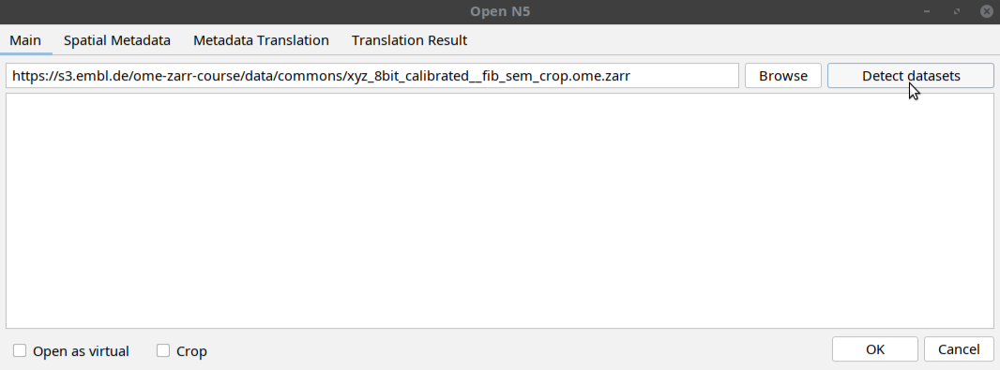
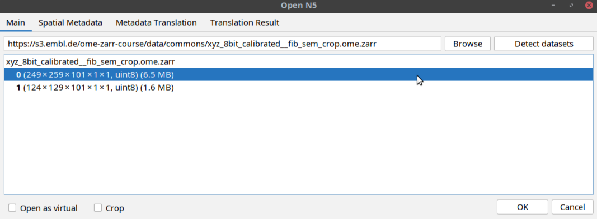
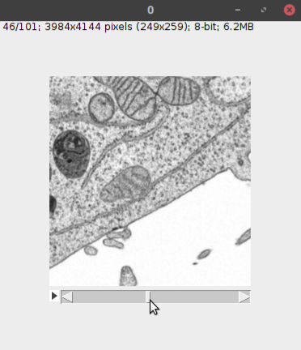
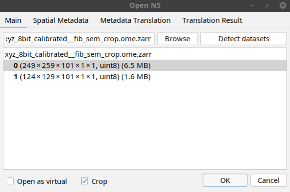
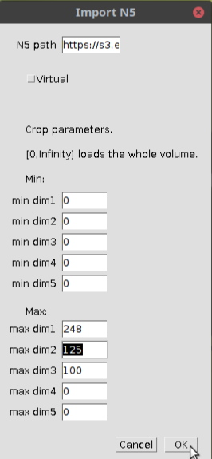
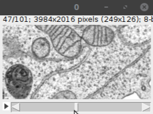

<style>
body {
    font-size: 20px !important;
}
h3 {
    font-size: 24px !important;
}
h4 {
    font-size: 22px !important;
}
</style>

### Open a remote OME-Zarr in Fiji

Open the n5-ij in Fiji via: 

```bash
[ File > Import > HDF5/N5/Zarr/OME-NGFF ... ]
```

On the window that opens, paste the following path in the uri space:

```bash
https://s3.embl.de/ome-zarr-course/data/commons/xyz_8bit_calibrated__fib_sem_crop.ome.zarr
```

Then click `Detect datasets` button as shown below: 



The tool will display a multiscales schema with two datasets in the dialog box.
Select one of the datasets as shown below and click OK:



This will open the dataset in Fiji as a normal Fiji image (see below).


### Open a Subset of a Remote OME-Zarr in Fiji

Follow the same steps above do select a dataset but instead of directly opening the dataset,
click the crop button in the window before clicking OK as shown below: <br>



In the window that open, select the indices of the subset as shown below: <br> 



When you click OK, the specified subset of the image will be opened as shown below: <br>


