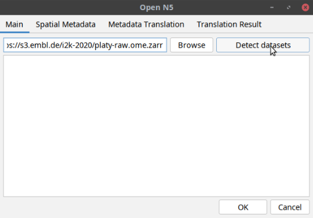
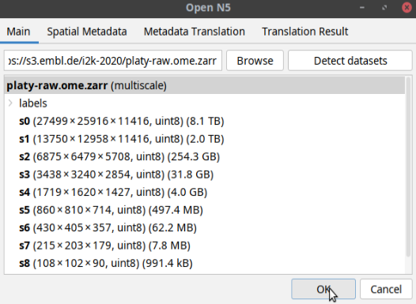
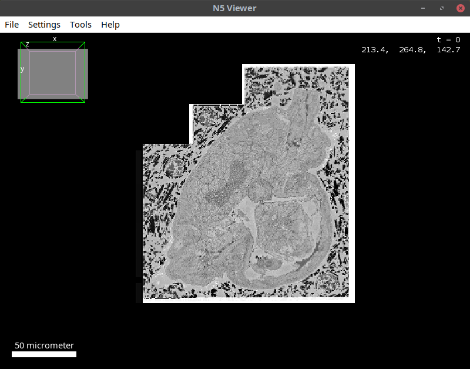
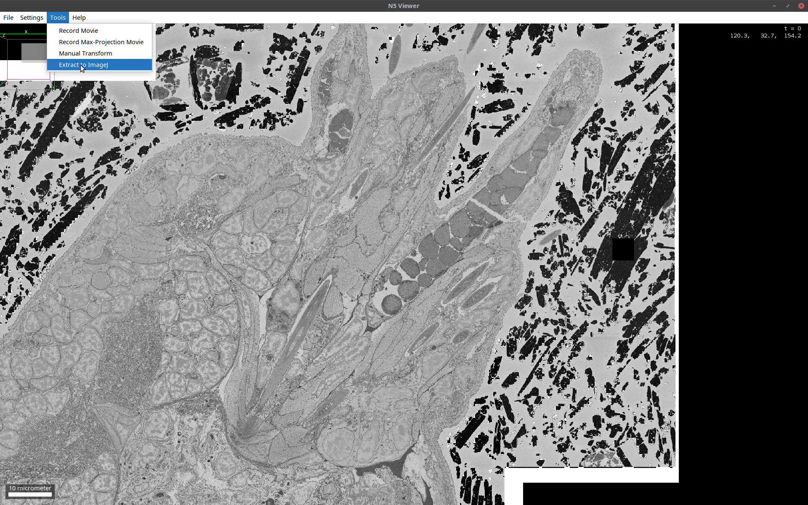
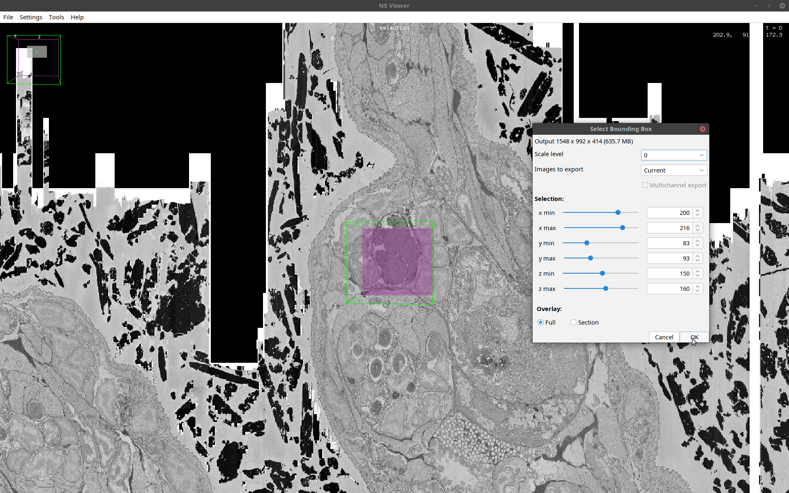
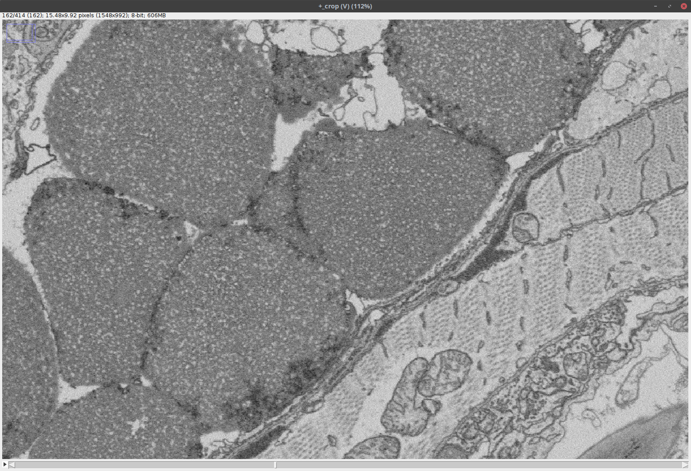

<style>
body {
    font-size: 20px !important;
}
h3 {
    font-size: 24px !important;
}
h4 {
    font-size: 22px !important;
}
</style>

### Opening a Remote OME-Zarr in BigDataViewer

Now let's imagine the dataset you want to open is too large to fit the RAM of your machine. 

Open the n5-viewer in Fiji via: 

`[ Plugins > BigDataViewer > HDF5/N5/Zarr/OME-NGFF Viewer ]`

In the window that opens, paste the following path in the uri space:

```shell
https://s3.embl.de/i2k-2020/platy-raw.ome.zarr
``` 

Then click `Detect datasets` button as shown below: 



The tool will display a multiscales schema with 9 datasets in the dialog box.
In this case, one can either open the individual datasets or the entire pyramid. 
To do the latter, click on the multiscale object and then click OK as shown below: 



This will open the multiscales object in BDV as shown below: 



### Extraction of a Subset of the OME-Zarr From BigDataViewer

The dataset opened as shown above is a huge (terabyte-scale) image, which is not amenable to processing as a whole
in Fiji. It is possible, however, to extract subsets of it to Fiji and continue with processing. To do so, follow the steps below:

In the BDV window, open the cropping window via: <br>
`[ Tools > Extract to ImageJ ]` (also see below) <br><br>


In the cropping window that opens, select the indices of the subset as shown below: <br>

 <br> 

Note that this step may require incremental rotation of the image and adjustment of the bounding box until
the desired region of interest is obtained. It is also important to check the size of the cropped volume 
at the top of the cropping window to make sure that it is not larger than the memory. Once you are fine
with the settings, click OK. <br>

The output is a standard Fiji image as shown below: <br>



Note that this image has been loaded into the RAM; as such, it can be processed like any other 
Fiji image and saved to any desired file format. 
