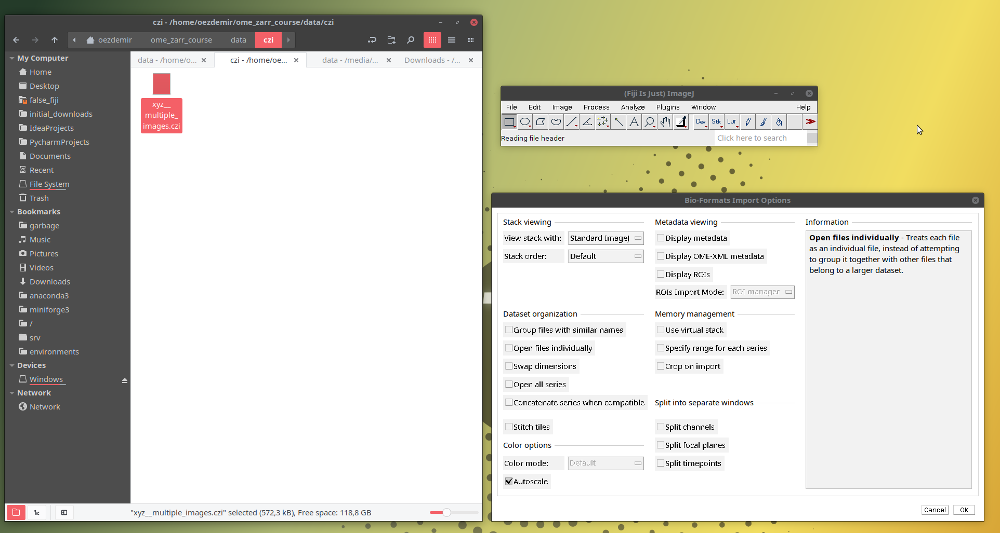
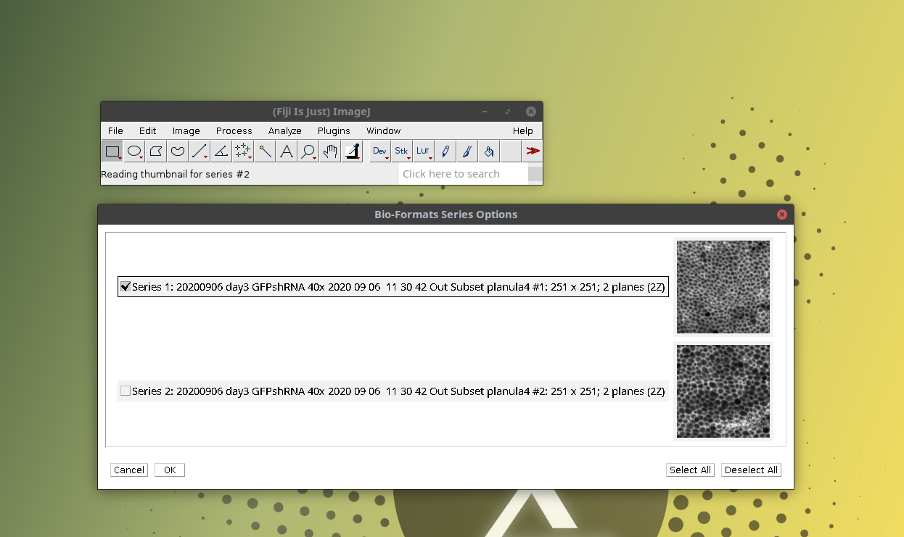
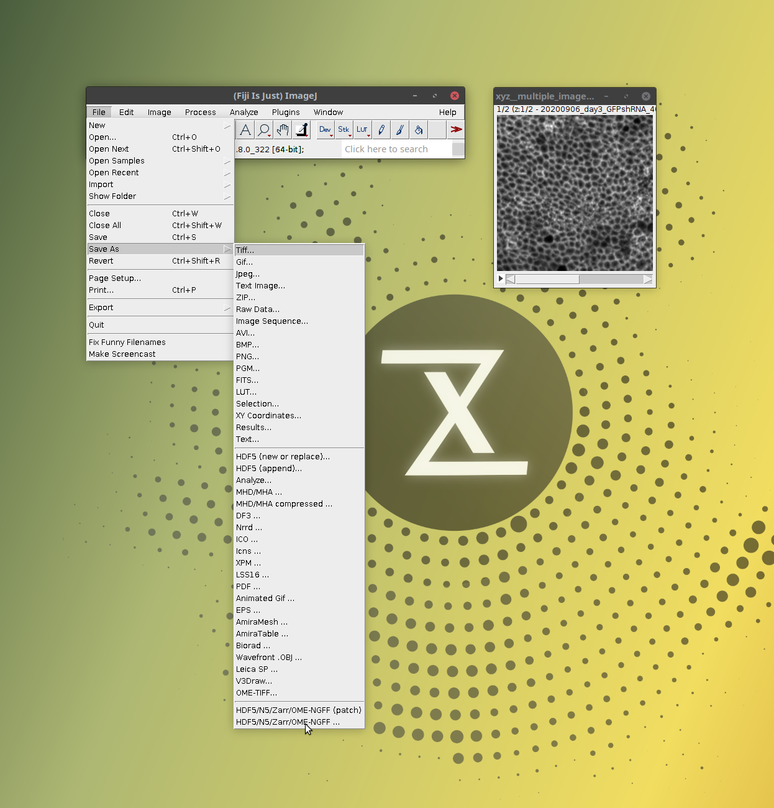
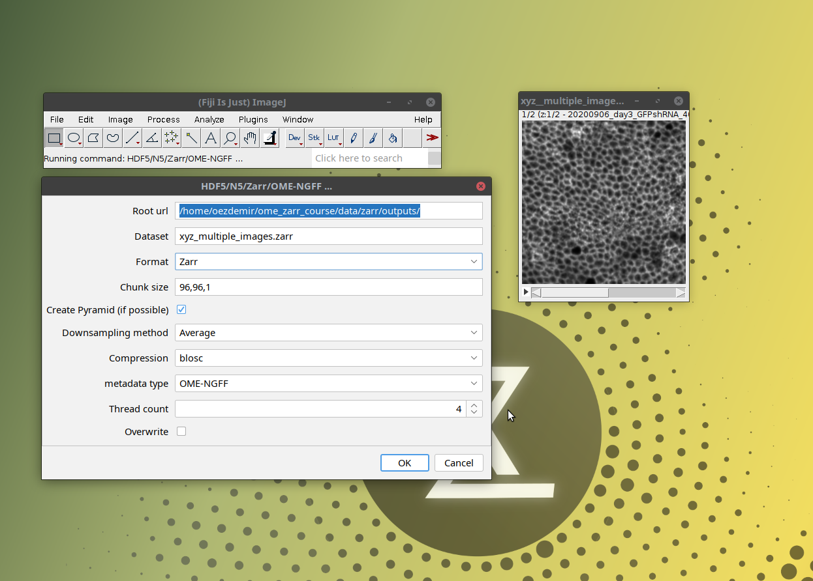

First open an image on Fiji by dragging and dropping the czi image from your local path (eg., `/path/to/data/pff/xyz__multiple_images.czi`) as shown below:   
  
A window titled **Bioformats Import Options** will open. Then click OK without changing any options.  
Another window titled **Bioformats Series Options** will open. This shows that the czi file contains two independent
images (or "series" in bioformats terminology). Then select one of the images and click OK as shown below:  
  
Now open the **n5-ij's saving tool** via: 
  - `[ File > Save As > HDF5/N5/Zarr/OME-NGFF ... ]` as shown below  
  
This will open a window with saving options (which define the properties of the output OME-Zarr) as shown below:  

